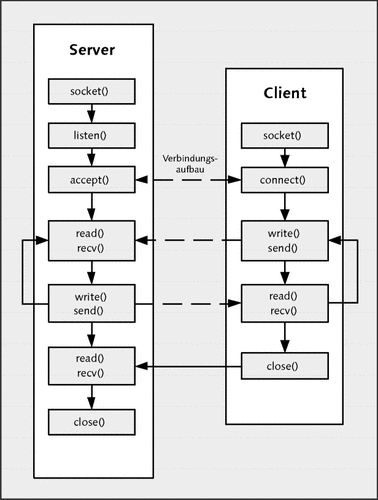

| Meilenstein | bis   |                          |   |   |
|-------------|-------|--------------------------|---|---|
| 1           | 29.04 | bis Socket Kommunikation |   |   |
| 2           | 20.05 | bis Multiclientfähigkeit |   |   |
| 3           | 10.06 | bis Pub/Sub              |   |   |

MS1:

- Client-Server Kommunikation
- Client Seite :
  - socket
  - connect
  - send
  - recv
  - close
- Server Seite
  - socket
  - bind
  - listen
  - accept
  - send
  - recv

Wir implementieren einen Server! Also implementieren wir die Funktionen,
die zu der Server gehören und die Serverschleife:
\
(Quelle: https://openbook.rheinwerk-verlag.de/c_von_a_bis_z/bilderklein/klein25_002.gif)

# Adress Struktur Socket
- Internet Socket-Adressenstruktur beruht auf struct *sockaddr_in*
- Definiert in <netinet/in.h>

struct sockaddr_in\
{\
short sin_family;        *// AF_INET (Tag)*\
unsigned short sin_port; *// TCP bzw. UDP Portnummer*\
struct in_addr sin_addr; *// 32-Bit IP-Adresse*\
char sin_zero[8]\
};

# Byte Order
Quelle: Beej's Guide to Network Programming\
The thing is, everyone in the Internet world has generally agreed that if you want to represent the two-byte hex number, say b34f, you’ll store it in two sequential bytes b3 followed by 4f. Makes sense, and, as Wilford Brimley17 would tell you, it’s the Right Thing To Do. This number, stored with the big end first, is called Big-Endian.

Unfortunately, a few computers scattered here and there throughout the world, namely anything with an Intel or Intel-compatible processor, store the bytes reversed, so b34f would be stored in memory as the sequential bytes 4f followed by b3. This storage method is called Little-Endian.

But wait, I’m not done with terminology yet! The more-sane Big-Endian is also called Network Byte Order because that’s the order us network types like.

Your computer stores numbers in Host Byte Order. If it’s an Intel 80x86, Host Byte Order is Little-Endian. If it’s a Motorola 68k, Host Byte Order is Big-Endian. If it’s a PowerPC, Host Byte Order is… well, it depends!

A lot of times when you’re building packets or filling out data structures you’ll need to make sure your two- and four-byte numbers are in Network Byte Order. But how can you do this if you don’t know the native Host Byte Order?

Good news! You just get to assume the Host Byte Order isn’t right, and you always run the value through a function to set it to Network Byte Order. The function will do the magic conversion if it has to, and this way your code is portable to machines of differing endiannes

# Systemaufrufe und deren Parameter
## Socket erzeugen socket()

socket_fd= socket(domain, type, protocol)\
socket_fd ist der Filedeskriptor, den wir zurückbekommen und return Wert ist int\
Der Fildeskriptor wird zur Identifikation des Sockets benutzt\
domain = Protokollfamilie zB AF_INET ist für ipv4\
type = Typ des Sockets z.B SOCK_STREAM ist für TCP Kommunikation \
protocol = genauer spezifizieren, aber in der Regel auf 0 gesetzt (= Standardprotokoll)\

## Binden einer Adresse an das Socket

result= bind(socket_fd, address, address_len);\

result ist mit return Wert int und ist 0 wenn das Binden erfolgreich war und -1 wenn fehlerhaft \
socket_fd ist der Filedeskriptor, den wir bei socket() zurückbekommen\
address ist die Adresse, an die das Socket gebunden werden soll und ist ein struct ( besteht aus IP Adresse Feld und Port Adresse Feld) ist in netinet/in.h definiert siehe oben\
address_len ist die Größe von address und wird oft mit sizeof berechnet\

Wenn man die Adresse an das Socket binden will, muss man die Felder der Adresse setzen:\

struct  sockaddr_in server; // Structfür die Adresseserver.\
sin_familiy= AF_INET; //für ipv4\
server.sin_addr.s_addr= INADDR_ANY; //alle erreichbare Hostadressen\
server.sin_port= htons(5678); // host byteordertonetworkbyteorder\

## 